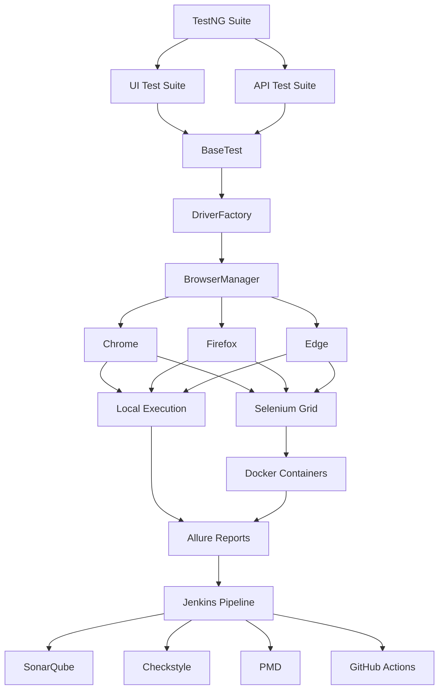
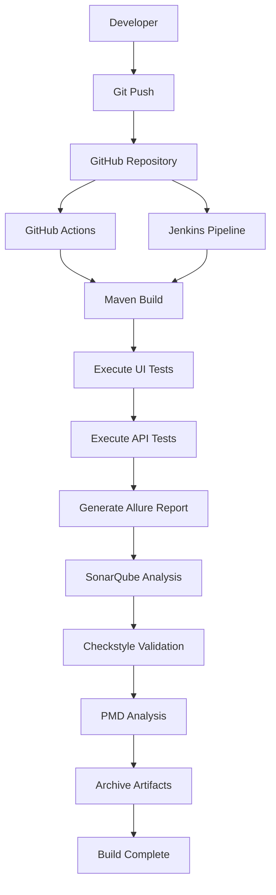
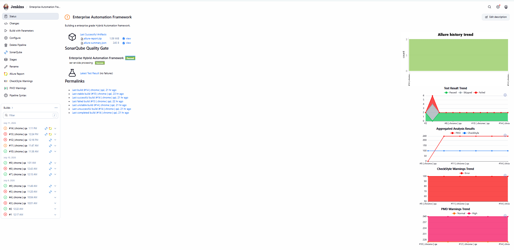
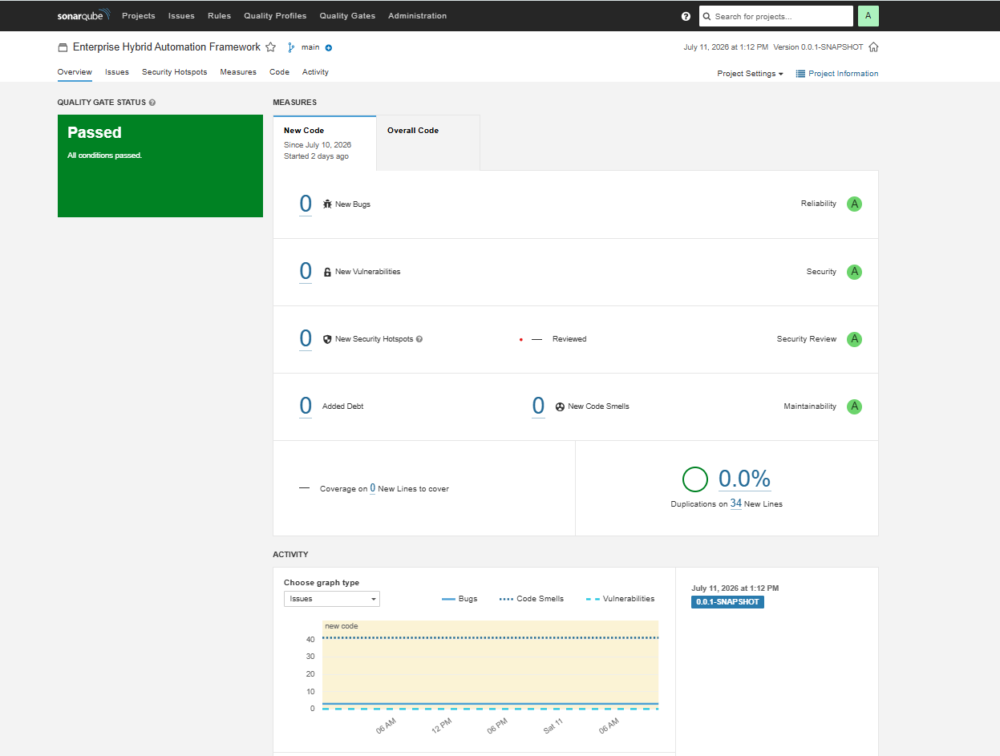
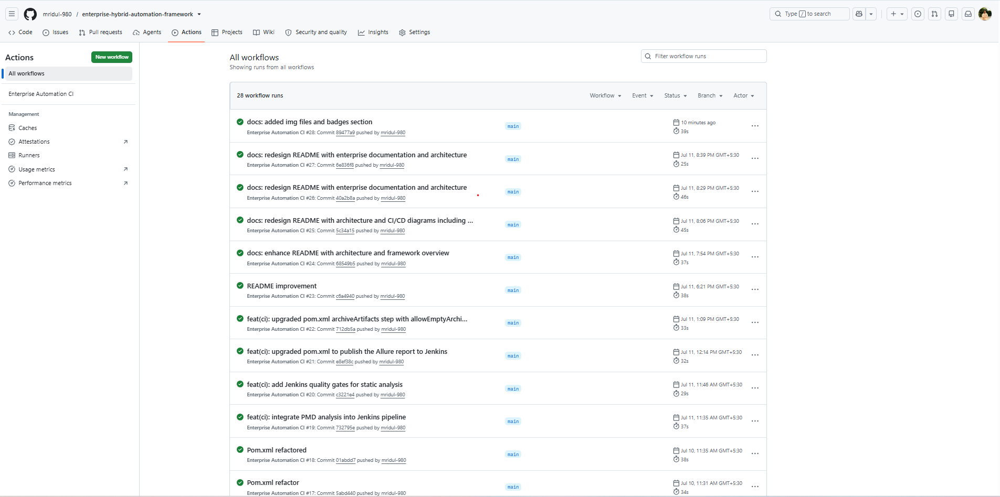
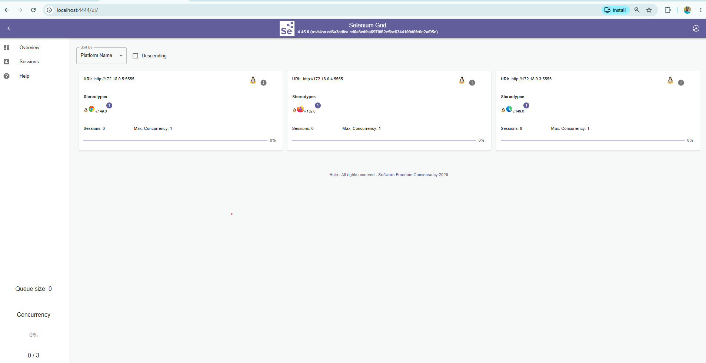
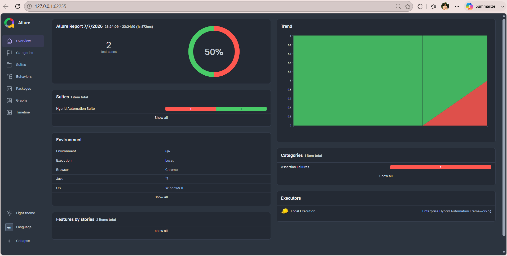

# 🚀 Enterprise Hybrid Automation Framework


> **A production-ready Enterprise Hybrid Test Automation Framework built using Java, Selenium WebDriver, TestNG, REST Assured, Docker, Selenium Grid, Jenkins, GitHub Actions, SonarQube, Checkstyle, PMD, and Allure Reporting.**

Designed with **scalability**, **maintainability**, and **enterprise engineering best practices**, this framework supports end-to-end automation across UI, API, and containerized environments while integrating modern CI/CD and code quality tools.

---

## ✨ Key Highlights

- ✅ Enterprise-grade UI Automation Framework
- ✅ REST API Automation using REST Assured
- ✅ Cross-Browser & Parallel Test Execution
- ✅ Local & Remote Execution (Selenium Grid)
- ✅ Docker & Docker Compose Integration
- ✅ Jenkins CI/CD Pipeline
- ✅ GitHub Actions Workflow
- ✅ SonarQube Static Code Analysis
- ✅ Checkstyle & PMD Quality Validation
- ✅ Allure Reporting with Execution Trends
- ✅ Thread-safe Driver Management
- ✅ Modular, Scalable & Maintainable Framework Architecture

---
## 📚 Table of Contents

- [About the Framework](#-about-the-framework)
- [Features](#-features)
- [Technology Stack](#-technology-stack)
- [Enterprise Feature Matrix](#-enterprise-feature-matrix)
- [Enterprise Automation Ecosystem](#-enterprise-automation-ecosystem)
- [CI/CD Pipeline](#-cicd-pipeline)
- [Project Structure](#-project-structure)
- [Getting Started](#-getting-started)
- [Running Tests](#-running-tests)
- [Reports & Code Quality](#-reports--code-quality)
- [Roadmap](#-roadmap)
- [Author](#-author)

# 📖 About the Framework

Modern enterprise automation is more than writing Selenium scripts.

This project demonstrates how a scalable automation framework can be designed using software engineering principles and integrated with modern DevOps practices.

The framework combines:

- UI Automation
- API Automation
- Containerized Test Execution
- CI/CD Pipelines
- Static Code Analysis
- Rich Test Reporting

to provide a maintainable and production-ready automation solution.

The project has been built with a focus on **clean architecture**, **reusability**, **parallel execution**, **configuration-driven execution**, and **continuous quality validation**.


# ✨ Features

## 🖥️ UI Automation

- Selenium WebDriver 4
- Java 17
- TestNG Framework
- Page Object Model (POM)
- Cross-Browser Testing
- Local & Remote Execution
- Selenium Grid Integration
- Parallel Test Execution
- Thread-safe Driver Management
- Smart Retry Mechanism
- Screenshot Capture on Failure

---

## 🌐 API Automation

- REST Assured
- GET, POST, PUT, PATCH & DELETE APIs
- Authentication Support
- Request & Response Specifications
- Path & Query Parameters
- Serialization & Deserialization
- JSON Schema Validation
- Generic API Client

---

## ⚙️ Framework Design

- Factory Design Pattern
- Configuration-driven Execution
- Environment Management
- Runtime Configuration
- Reusable Utility Classes
- ThreadLocal WebDriver
- Logging with Log4j2
- Modular & Scalable Architecture

---

## 🚀 DevOps & CI/CD

- Git & GitHub
- GitHub Actions
- Jenkins Declarative Pipeline
- Parameterized Jenkins Builds
- Docker Integration
- Docker Compose
- Selenium Grid
- Build Artifact Archiving

---

## 📊 Reporting & Quality Engineering

- Allure Reports
- TestNG Reports
- Execution Logs
- SonarQube Code Analysis
- Checkstyle Validation
- PMD Static Analysis
- Jenkins Quality Gates
- Build Stability Monitoring

---

### ✅ API Automation

- Rest Assured
- GET
- POST
- PUT
- PATCH
- DELETE
- Authentication
- Path Parameters
- Query Parameters
- Serialization
- Deserialization
- JSON Schema Validation

---

### ✅ Framework Capabilities

- Factory Design Pattern
- Runtime Configuration
- Environment-based Configuration
- Generic API Client
- Request & Response Specifications
- Data Driven Testing
- JSON Test Data
- Logging (Log4j2)
- Extent Reports
- Screenshots on Failure

---

### ✅ DevOps

- Git & GitHub
- Docker
- Docker Compose
- Selenium Grid
- Jenkins Ready

---
# 🛠️ Technology Stack & Engineering Ecosystem

| Category | Technologies |
|----------|--------------|
| **Programming Language** | Java 17 |
| **UI Automation** | Selenium WebDriver 4 |
| **API Automation** | REST Assured |
| **Test Framework** | TestNG |
| **Build & Dependency Management** | Maven |
| **Design Patterns** | Page Object Model (POM), Factory Pattern, Singleton, ThreadLocal |
| **Configuration Management** | Properties Files, Runtime Configuration |
| **Reporting** | Allure Reports, TestNG Reports |
| **Logging** | Log4j2 |
| **Containerization** | Docker, Docker Compose |
| **Cross-Browser Execution** | Selenium Grid |
| **CI/CD** | Jenkins, GitHub Actions |
| **Code Quality** | SonarQube, Checkstyle, PMD |
| **Version Control** | Git, GitHub |
| **Development Tools** | IntelliJ IDEA / Eclipse, VS Code |
| **Database** | PostgreSQL *(JDBC integration planned)* |
| **Operating System** | Windows 11 |

# 🎯 Enterprise Capabilities

| Capability | Status |
|------------|:------:|
| UI Automation | ✅ |
| API Automation | ✅ |
| Cross-Browser Testing | ✅ |
| Parallel Execution | ✅ |
| Selenium Grid | ✅ |
| Docker Execution | ✅ |
| Jenkins Pipeline | ✅ |
| GitHub Actions | ✅ |
| SonarQube Analysis | ✅ |
| Checkstyle | ✅ |
| PMD | ✅ |
| Allure Reporting | ✅ |
| Thread-safe Execution | ✅ |
| Database Testing (JDBC) | 🚧 Planned |
| Cloud Grid Integration | 🚧 Planned |

The following diagram illustrates the overall architecture of the Enterprise Hybrid Automation Framework, including test execution, browser management, CI/CD integration, reporting, and quality engineering components.

# 🏗️ Enterprise Automation Ecosystem



### Key Components

| Layer | Responsibility |
|--------|----------------|
| TestNG | Test execution engine |
| UI Automation | Selenium-based functional testing |
| API Automation | REST Assured API validation |
| DriverFactory | Thread-safe WebDriver lifecycle |
| BrowserManager | Browser initialization & configuration |
| Selenium Grid | Distributed remote execution |
| Docker | Containerized execution environment |
| Jenkins | CI/CD orchestration |
| SonarQube | Code quality analysis |
| Checkstyle | Coding standards validation |
| PMD | Static code analysis |
| Allure | Rich reporting & execution history |

---

# 🔄 CI/CD Pipeline

The following diagram illustrates the end-to-end Continuous Integration and Continuous Delivery (CI/CD) workflow for the Enterprise Hybrid Automation Framework.



### Pipeline Stages

| Stage | Description |
|--------|-------------|
| Git Push | Source code committed to GitHub |
| GitHub Actions | Automatically triggers workflow on every push |
| Jenkins Pipeline | Parameterized CI/CD execution |
| Maven Build | Project compilation and dependency management |
| UI Automation | Selenium WebDriver execution |
| API Automation | REST Assured execution |
| Allure Reports | Rich HTML reporting |
| SonarQube | Static code quality analysis |
| Checkstyle | Coding standards validation |
| PMD | Static code analysis |
| Artifact Archiving | Stores reports and build outputs |

# 📂 Project Structure

```text
src
├── main
│   ├── java
│   │   ├── api          → REST Assured client & endpoint classes
│   │   ├── auth         → Authentication utilities
│   │   ├── constants    → Framework constants
│   │   ├── drivers      → WebDriver management
│   │   ├── factory      → Driver & Browser Factory
│   │   ├── listeners    → TestNG listeners
│   │   ├── pages        → Page Object Model classes
│   │   ├── specs        → Request & Response Specifications
│   │   └── utilities    → Common reusable utilities
│   │
│   ├── resources
│   │   ├── config
│   │   ├── schemas
│   │   └── testdata
│
├── test
│   ├── java
│   │   ├── tests
│   │   └── testdata
│
├── Dockerfile
├── docker-compose.yml
├── Jenkinsfile
├── pom.xml
└── README.md
```
### 📦 Package Responsibilities

| Package | Responsibility |
|---------|----------------|
| api | REST Assured API implementation |
| auth | Authentication utilities |
| constants | Framework constants |
| drivers | WebDriver lifecycle management |
| factory | Browser and Driver Factory |
| listeners | TestNG listeners & reporting |
| pages | Page Object Model implementation |
| specs | REST Assured specifications |
| utilities | Common reusable utilities |
| resources | Configuration, schemas & test data |
| tests | UI & API automated test suites |

---

# ▶ Running Tests

## UI Tests (Local)

```bash
mvn clean test
```

---

## API Tests

```bash
mvn clean test -Dsurefire.suiteXmlFiles=testng-api.xml
```

---

## Remote Execution using Selenium Grid

Update:

```properties
execution=remote
```

Start Selenium Grid

```bash
docker compose up -d
```

Execute Tests

```bash
mvn clean test
```

---

# 🐳 Docker

## Build Docker Image

```bash
docker build -t enterprise-hybrid-automation-framework .
```

## Execute API Tests

```bash
docker run --rm enterprise-hybrid-automation-framework
```

---

# 🌐 Selenium Grid

Start Grid

```bash
docker compose up -d
```

Open

```
http://localhost:4444
```

---
# 📸 Framework Screenshots

| Jenkins Dashboard | SonarQube Dashboard |
|-------------------|---------------------|
|  |  |

| GitHub Actions | Selenium Grid |
|----------------|---------------|
|  |  |

| Allure Report |
|---------------|
|  |

# 📊 Reports & Code Quality

The framework provides comprehensive reporting and static code quality analysis.

### Reporting

- ✅ Allure Reports
- ✅ TestNG Reports
- ✅ Jenkins Build Artifacts
- ✅ Screenshots on Failure
- ✅ Log4j2 Execution Logs

### Code Quality

- ✅ SonarQube Analysis
- ✅ Checkstyle Validation
- ✅ PMD Static Code Analysis
- ✅ Jenkins Quality Gates

---

# 🎯 Design Patterns Used

- Factory Pattern
- Page Object Model (POM)
- Singleton (Configuration Management)
- ThreadLocal Driver Management

---

# 🚀 Roadmap

### Version 5.0

- 🚧 JDBC Database Testing
- 🚧 Cloud Selenium Grid
- 🚧 BrowserStack / LambdaTest Integration
- 🚧 Performance Testing
- 🚧 AI-assisted Test Insights

---

# 👨‍💻 Author

**Mridul Tripathi**

Software QA Engineer | SDET | Test Automation Engineer

- GitHub: https://github.com/mridul-980
- LinkedIn: https://www.linkedin.com/in/mridul-tripathi-32ab3921b/
- Email: mridultripathi204@gmail.com

---

## ⭐ Support

If you found this project useful, consider giving it a ⭐ on GitHub.