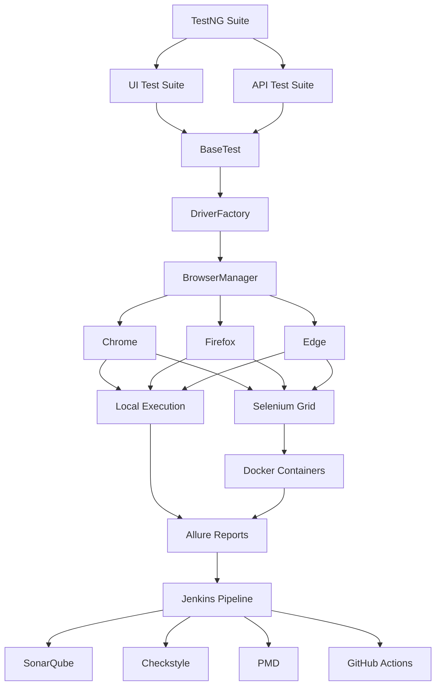

# 🚀 Enterprise Hybrid Automation Framework


> **A production-ready Enterprise Hybrid Test Automation Framework built using Java, Selenium WebDriver, TestNG, REST Assured, Docker, Selenium Grid, Jenkins, GitHub Actions, SonarQube, Checkstyle, PMD, and Allure Reporting.**

Designed with **scalability**, **maintainability**, and **enterprise engineering best practices**, this framework supports end-to-end automation across UI, API, and containerized environments while integrating modern CI/CD and code quality tools.

---

## ✨ Key Highlights

- ✅ Enterprise-grade UI Automation Framework
- ✅ REST API Automation using REST Assured
- ✅ Cross-Browser & Parallel Test Execution
- ✅ Local & Remote Execution (Selenium Grid)
- ✅ Docker & Docker Compose Integration
- ✅ Jenkins CI/CD Pipeline
- ✅ GitHub Actions Workflow
- ✅ SonarQube Static Code Analysis
- ✅ Checkstyle & PMD Quality Validation
- ✅ Allure Reporting with Execution Trends
- ✅ Thread-safe Driver Management
- ✅ Modular, Scalable & Maintainable Framework Architecture

---

# 📖 About the Framework

Modern enterprise automation is more than writing Selenium scripts.

This project demonstrates how a scalable automation framework can be designed using software engineering principles and integrated with modern DevOps practices.

The framework combines:

- UI Automation
- API Automation
- Containerized Test Execution
- CI/CD Pipelines
- Static Code Analysis
- Rich Test Reporting

to provide a maintainable and production-ready automation solution.

The project has been built with a focus on **clean architecture**, **reusability**, **parallel execution**, **configuration-driven execution**, and **continuous quality validation**.


# ✨ Features

## 🖥️ UI Automation

- Selenium WebDriver 4
- Java 17
- TestNG Framework
- Page Object Model (POM)
- Cross-Browser Testing
- Local & Remote Execution
- Selenium Grid Integration
- Parallel Test Execution
- Thread-safe Driver Management
- Smart Retry Mechanism
- Screenshot Capture on Failure

---

## 🌐 API Automation

- REST Assured
- GET, POST, PUT, PATCH & DELETE APIs
- Authentication Support
- Request & Response Specifications
- Path & Query Parameters
- Serialization & Deserialization
- JSON Schema Validation
- Generic API Client

---

## ⚙️ Framework Design

- Factory Design Pattern
- Configuration-driven Execution
- Environment Management
- Runtime Configuration
- Reusable Utility Classes
- ThreadLocal WebDriver
- Logging with Log4j2
- Modular & Scalable Architecture

---

## 🚀 DevOps & CI/CD

- Git & GitHub
- GitHub Actions
- Jenkins Declarative Pipeline
- Parameterized Jenkins Builds
- Docker Integration
- Docker Compose
- Selenium Grid
- Build Artifact Archiving

---

## 📊 Reporting & Quality Engineering

- Allure Reports
- TestNG Reports
- Execution Logs
- SonarQube Code Analysis
- Checkstyle Validation
- PMD Static Analysis
- Jenkins Quality Gates
- Build Stability Monitoring

---

### ✅ API Automation

- Rest Assured
- GET
- POST
- PUT
- PATCH
- DELETE
- Authentication
- Path Parameters
- Query Parameters
- Serialization
- Deserialization
- JSON Schema Validation

---

### ✅ Framework Capabilities

- Factory Design Pattern
- Runtime Configuration
- Environment-based Configuration
- Generic API Client
- Request & Response Specifications
- Data Driven Testing
- JSON Test Data
- Logging (Log4j2)
- Extent Reports
- Screenshots on Failure

---

### ✅ DevOps

- Git & GitHub
- Docker
- Docker Compose
- Selenium Grid
- Jenkins Ready

---
# 🏗️ Enterprise Automation Ecosystem


````markdown
### Key Components

| Layer | Responsibility |
|--------|----------------|
| TestNG | Test execution engine |
| UI Automation | Selenium-based functional testing |
| API Automation | REST Assured API validation |
| DriverFactory | Thread-safe WebDriver lifecycle |
| BrowserManager | Browser initialization & configuration |
| Selenium Grid | Distributed remote execution |
| Docker | Containerized execution environment |
| Jenkins | CI/CD orchestration |
| SonarQube | Code quality analysis |
| Checkstyle | Coding standards validation |
| PMD | Static code analysis |
| Allure | Rich reporting & execution history |

# 🏗 Framework Architecture

```text
                 BaseTest
                     │
             BrowserManager
                     │
             BrowserFactory
                     │
         ┌───────────┴───────────┐
         │                       │
    Local Driver           Remote Driver
         │                       │
 Chrome / Edge / Firefox    Selenium Grid
                                     │
                              Docker Container
```

---

# 🛠️ Technology Stack

| Category | Technologies |
|----------|--------------|
| Programming Language | Java 17 |
| UI Automation | Selenium WebDriver 4 |
| API Automation | REST Assured |
| Test Framework | TestNG |
| Build Tool | Maven |
| Design Patterns | Page Object Model, Factory Pattern, Singleton |
| Logging | Log4j2 |
| Reporting | Allure Reports, TestNG Reports |
| Containerization | Docker, Docker Compose |
| Cross-Browser Testing | Selenium Grid |
| CI/CD | Jenkins, GitHub Actions |
| Code Quality | SonarQube, Checkstyle, PMD |
| Version Control | Git, GitHub |

---

# 📂 Project Structure

```text
enterprise-hybrid-automation-framework
│
├── src
│   ├── main
│   │   ├── java
│   │   │   ├── api
│   │   │   ├── auth
│   │   │   ├── constants
│   │   │   ├── drivers
│   │   │   ├── factory
│   │   │   ├── listeners
│   │   │   ├── pages
│   │   │   ├── specs
│   │   │   └── utilities
│   │
│   ├── test
│   │   ├── java
│   │   │   ├── tests
│   │   │   └── testdata
│   │
│   └── resources
│       ├── config
│       ├── schemas
│       └── testdata
│
├── Dockerfile
├── docker-compose.yml
├── Jenkinsfile
├── pom.xml
└── README.md
```

---

# ▶ Running Tests

## UI Tests (Local)

```bash
mvn clean test
```

---

## API Tests

```bash
mvn clean test -Dsurefire.suiteXmlFiles=testng-api.xml
```

---

## Remote Execution using Selenium Grid

Update:

```properties
execution=remote
```

Start Selenium Grid

```bash
docker compose up -d
```

Execute Tests

```bash
mvn clean test
```

---

# 🐳 Docker

## Build Docker Image

```bash
docker build -t enterprise-hybrid-automation-framework .
```

## Execute API Tests

```bash
docker run --rm enterprise-hybrid-automation-framework
```

---

# 🌐 Selenium Grid

Start Grid

```bash
docker compose up -d
```

Open

```
http://localhost:4444
```

---

# 📊 Reports

- Extent Reports
- TestNG Reports
- Screenshots on Failure
- Log4j2 Logs

---

# 🎯 Design Patterns Used

- Factory Pattern
- Page Object Model (POM)
- Singleton (Configuration Management)
- ThreadLocal Driver Management

---

# 🚀 Future Enhancements

- Parallel Cross-Browser Execution
- GitHub Actions CI/CD
- Allure Reporting
- Browser Matrix Execution
- Database Testing
- Performance Testing
- Cloud Selenium Grid
- AI-powered Test Reporting

---

# 👨‍💻 Author

**Mridul Tripathi**

Software QA Engineer | SDET | Test Automation Engineer

GitHub:

https://github.com/mridul-980/enterprise-hybrid-automation-framework

---

## ⭐ Support

If you found this project useful, consider giving it a ⭐ on GitHub.